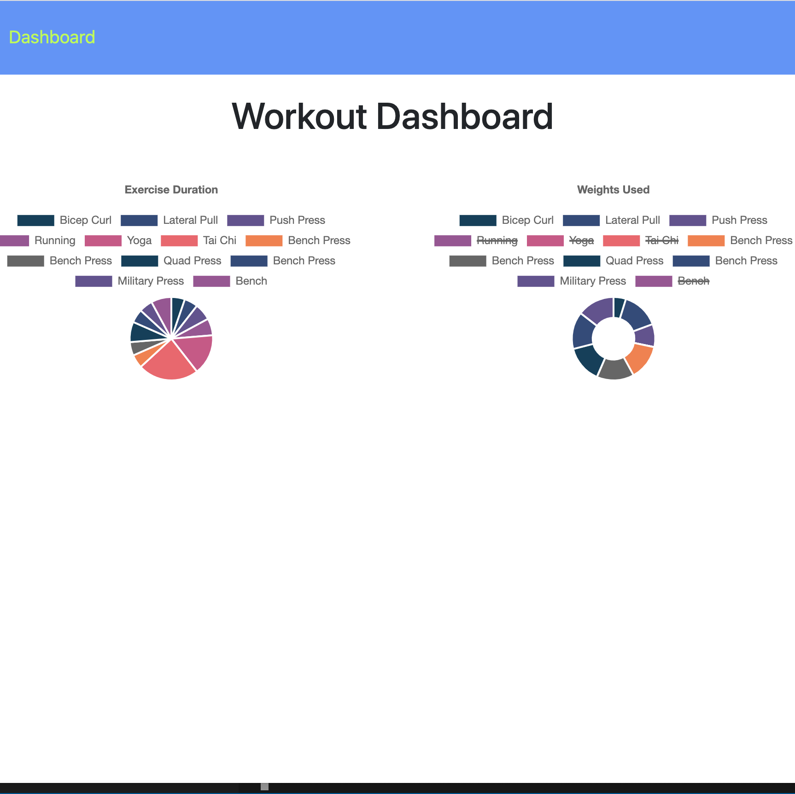

# exercise-tracker
A Workout Tracker in which the user can view, create, add to, and track daily workouts. They can log many exercises per workout and track their stats and workout progress.  Stats include the name, type, weight, sets, reps, and duration of exercise. 

## Description
  This is a fitness tracker app to add, update, and track exercises within each workout that the user engages in. They can add a new workout or update a current workout! The app utilizes a Mongo database with a Mongoose schema and handles routes and the server with Express.

[Link to project](https://aqueous-thicket-78682.herokuapp.com/)  

[Link to Repo](https://github.com/erin-smith/exercise-tracker)    
    
  

## Table of Contents
* [Installation](#Installation)
* [Usage](#Usage)
* [License](#License)
* [Contributing](#Contributing)
* [Tests](#Tests)
* [Questions](#Questions)
 
 
## Installation 

  This project uses node, mongoDB, mongoose, path, and express. To use this project you can clone the repository, open the file in VScode and open the terminal. Make sure that you have node.js locally installed.  

Installation code:
   
This app is deployed on Heroku and installation is not necessary, but if you are still interested:  
  
To install the program, run the following command(s):`npm install`    
This will install the necessary dependencies listed in the package.json file.  You will also need to have MongoDB locally installed.   

To start up Mongo, run the following commands(s):  
`mongod`    

In a separate terminal tab, run the following command(s):  
`npm run seeds`  

To invoke the application, run the following command(s):  
  `npm start`  

## Usage   
  
To use this app, no installation is necessary.  Just go to the following [Link to project](https://aqueous-thicket-78682.herokuapp.com/):  

  https://aqueous-thicket-78682.herokuapp.com/  
   
  A user can track their daily workouts, stats, and reach their fitness goals by logging their exercises.  They can see duration and distance and each exercise completed.

## License 

  This project is licensed under the ISC license. 

## Contributing   
 If you would like to contribute to this project or have feedback, please contact me below in the Questions Section.
***
 **Contributors:** erin-smith   
***

## Tests 
  To run tests, I used the debugger in VScode, nodemon, and console.logs.
    

## Questions:  
  

  If you have any questions about the repo, [open an issue](https://github.com/erin-smith/exercise-tracker/issues/new) or contact me:  

* [My GitHub Profile](http://github.com/erin-smith)
* 
***
